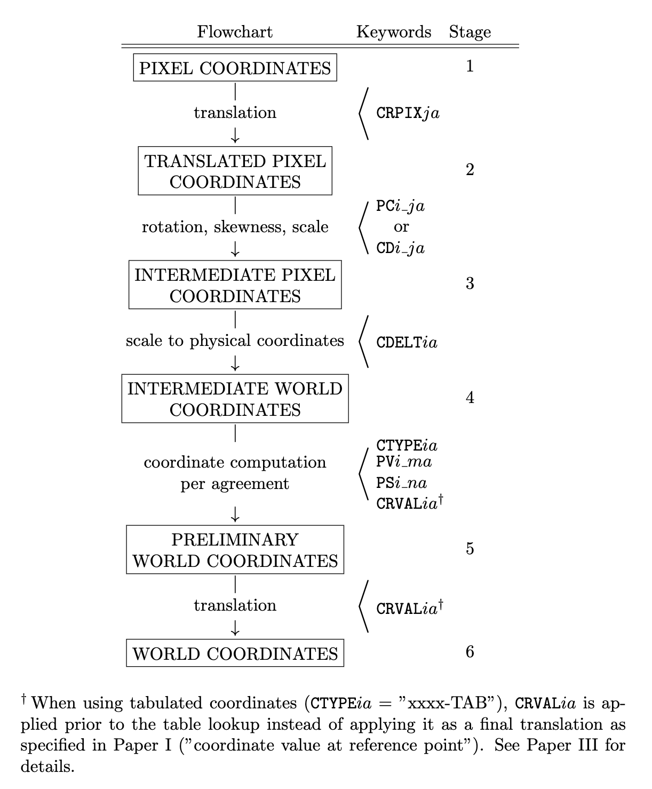

(appendix-vi)=
# Appendix VI. Extended mechanism for distortion corrections

Paper V describes a mechanism for applying coordinate distortion corrections using the keyword pairs `CPDISja` and `DPja`, or `CQDISia` and `DQia`. Here we discuss the 'Lookup' form of the mechanism, but the results may also be applied to the other forms described in Paper V.

Below we use the term “distortion array”, not the equivalent “distortion data cube”. This is simply to more easily distinguish between “the data cube whose coordinates are to be corrected” versus the “data array containing the distortions”.

When reading Paper V as a background for this Appendix, the term “axis” should in most places be replaced by “coordinate” to match the discussion below.

With the `CPDISja`/`DPja` formulation from Paper V, the data cube’s pixel coordinates are associated with the distortion array’s intermediate world coordinates as a basis for lookup/interpolation of distortion values in the distortion array (Paper V, Section 3.4, last paragraph on page 9). The distortion values are then applied back to the data cube’s pixel coordinates.

With the `CQDISia`/`DQia` formulation from Paper V, it is the data cube’s _intermediate_ pixel coordinates that are associated with the distortion array’s intermediate world coordinates, and the distortion is then applied back to the data cube’s _intermediate_ pixel coordinates.

Thus, the original mechanism may only be used to specify coordinate distortions _based on and applied to the same coordinate stage:_ pixel coordinate distortions can only be specified based on pixel coordinates, and intermediate pixel coordinate distortions can only be specified based on intermediate pixel coordinates. No other distortions are allowed, i.e., distortions can never be expressed in the final world coordinate units, not even based on the world coordinates themselves.

We have therefore chosen to extend the mechanism described in Paper V such that distortions may be specified more generally. With the extended mechanism described here, cavity errors can be represented using a map of as a function of pixel coordinates, independent of tuning parameters.

We do this by introducing the keyword pair `CWDISia`/`DWia` in analogy with the `CPDISja`/`DPja` and `CQDISia`/`DQia` keyword pairs (and analogous forms for the binary table forms). Additionally, `CWERRia` replaces `CPERRja` and `CQERRia`.

As with `DPja` and `DQia` in Paper V, `DWia` is a record-valued keyword which may have multiple values in the same header for the same `i`, e.g., both `DW1='NAXES: 1'` and `DW1='AXIS.1: 1'` may occur in the same header. In text, this is written as `DW1•NAXES=1` and `DW1•AXIS.1=1` . The `DWia` records describe the association of coordinates between the distortion array and the data cube whose coordinates are to be corrected.

The specification for `CWDISia`/`DWia`/`CWERRia` given here is identical to the specification for `CPDISja`/`DPja`/`CPERRja` and `CQDISia`/`DQia`/`CQERRia` given in Paper V, except for the addition of two new record values:

`DWia•ASSOCIATE` specifies the data cube coordinate stage from which coordinate values are taken for association with the distortion array coordinates. I.e., if `DWia•ASSOCIATE` is equal to A, then data cube coordinates from stage A are used for lookup/interpolation into the distortion array to find the correction.

`DWia•APPLY` specifies the coordinate stage to which the distortion should be applied (added). I.e., if `DWia•APPLY` is equal to B, the distortion values should be added immediately after calculating the values in stage B.

All `DWia` records for a given coordinate correction should be given as contiguous sequence in the FITS header. The `DWia•APPLY` record must be the last record in this sequence.

Since record-valued keywords can only have numeric values, we must assign numbers to the coordinate stages in order to refer to them. We specify the stage numbers using a more detailed version of the normal FITS coordinate calculation flowchart, with the stage numbers given in the rightmost column:

The association of coordinates between the data cube and the distortion array may happen at any of the calculation stages 1-6 for the data cube. The distortion found by interpolation in the distortion array may then be applied to the data cube coordinates at the same stage or any of the later stages. I.e., `DWia•APPLY >= DWia•ASSOCIATE`.

Thus, using the original `CPDISja`/`DPja` formulation corresponds to `DWia•ASSOCIATE = DWia•APPLY = 1`, and using the `CQDISia`/`DQia` formulation is equivalent to, and `DWia•ASSOCIATE = DWia•APPLY = 3`.

A simple example is the Solar Orbiter/SPICE pipeline (see Haugan and Fredvik 2023). After a significant re-pointing or a wheel off-loading it may take tens of minutes, even hours, until the pointing of Solar Orbiter is stable. If SPICE is observing during a period of unstable spacecraft pointing it may be necessary to take the pointing instability into account when calculating the Solar X and Solar Y coordinates of the observation. These coordinate distortion corrections are specified using `DWia•ASSOCIATE=1` and `DWia•APPLY=6`. The solar coordinates may therefore be calculated the regular way using the equation on page 8, and then the coordinate distortion corrections are applied to the world coordinates.

A more complex example, for which the original mechanism described in Paper V would be untenable, is for scanning spectrometers (e.g., Fabry-Perot),

With uneven spectrometer tuning steps, the wavelength coordinate must be tabulated using the lookup method described in Paper III. This results in a varying and _discontinuous_ derivative of the translation from pixel coordinates to wavelength coordinates. Since cavity errors are measured as , a reverse lookup would have to be done to calculate the correct pixel or intermediate pixel coordinate distortions. If there are variations in the tuning steps over time, and/or rotations/movements of the FOV placement on the detector that are compensated for, this calculation could become prohibitive for high-speed processing of data, and it could significantly increase the file size. It would also be difficult to interpret the distortion arrays directly as distortion maps – they would be expressed in pixel or intermediate pixel coordinates, not in {math}`\Delta\lambda`. To inspect the applied correction as a distortion map, two coordinate calculations would have to be performed – one with corrections and one without corrections – to see the difference between the two.

In the SSTRED pipeline (see Löfdahl et al. 2021), cavity errors are specified using `DWia•ASSOCIATE=1` and `DWia•APPLY=6`. Thus, cavity errors are specified by lookup/interpolation using the data cube’s pixel coordinate system but applied to the world coordinates.

Paper V implicitly states that the distortion array’s intermediate world coordinates should be used during the association with the data cube’s coordinates – i.e., after application of the distortion array’s `CRPIXj`/`CDELTi`/`CRVALi`, but they exclude the use of `PCi_j`. In other words, the distortion array coordinates may not be rotated nor sheared, but must rather be defined on a rectangular, equidistant grid. We see no reason to keep this restriction, but rather define the association to be performed _using the distortion array’s world coordinates, however they may be specified_. Thus, specifications of coordinates for the distortion array follow the same rules as for any other HDU, and it is the final coordinates of the distortion array that should be used during the association of coordinates between the distortion array and the data cube.

This will allow specification of distortion arrays with rotated and, not least, non-equidistant coordinates, which may make more sense for some applications, and may also save significant space.

As mentioned initially, the extension of Paper V’s formalism may also be applied to distortion specifications other than `'Lookup'`. I.e., if `DWia•ASSOCIATE` is equal to A, then data cube coordinates from stage A are used as arguments to the specified distortion function in order to calculate the distortion values.

The resulting distortion values are then applied (added) to the coordinate values specified by `DWia•APPLY`. I.e., if `DWia•APPLY` is equal to B, the distortion values should be added immediately after calculating the values in stage B.

(appendix-via)=
## Appendix VI-a. Multiple distortion corrections to the same coordinate

If e.g., one distortion is best specified using a polynomial and another distortion of the same coordinate must be specified by table lookup, they can be specified individually using multiple corrections. Multiple distortion corrections are specified by multiple sets of `DWia` records, each ending with `DWia•APPLY`. No DWia record applying to a subsequent correction may occur before the `DWia•APPLY` record of a previous correction.

`DWia•APPLY` values may never decrease from one correction to the next. When using multiple corrections for a single coordinate, they should be separated by a COMMENT line, to decrease the theoretical chance that some FITS processing software reorders the keywords.

Distortions with the same `DWia•APPLY` values are added together.

If a subsequent correction has `DWia•ASSOCIATE` equal to the `DWia•APPLY` of a previous correction, it is the _uncorrected coordinate values_ from the `DWia•ASSOCIATE` stage that should be used as a basis for the subsequent correction.

If instead a subsequent correction must be performed on _corrected coordinate values_ from a previous correction, chaining of corrections may be specified using fractional values for the `DWia•APPLY` and `DWia•ASSOCIATE` records. Fractional `DWia•APPLY` values implicitly define new coordinate stages in between the integer-valued stages defined here, which may then be referenced by a subsequent `DWia•ASSOCIATE` record.

E.g., if one correction has `DWia•ASSOCIATE=1` and `DWia•APPLY=1.1`, a subsequent correction may have `DWia•ASSOCIATE=1.1`, meaning that the coordinate values _after_ the first correction should be used for association during the second correction.
